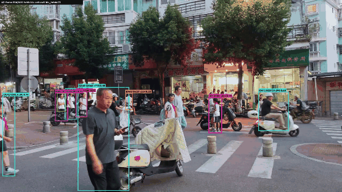

# 基于多图查询的视频目标人物检索系统

> 输入目标人物 1~N 张全身照片 → 分析监控/街景视频 → 返回"是谁（跟踪ID）、几点到几点出现过、走过哪些位置"。
> 技术链：YOLOv8 检测 → ByteTrack 跟踪 → 自训练 OSNet 特征 → 多图 max 融合检索 → 轨迹后合并。
> 全部指标为 RTX 3060 Ti 实测（2026-09/10），非引用值；演示视频与档案数据因隐私/体积不入库。

**跟踪效果演示**（目标近景接力段，框上标 `ID原始号 G组号 h框高`；t≈13s 处可见 ByteTrack 换号、ReID 后合并把 G101 接回同一人）：



## 架构

```
[索引端]  视频 ─流式抽帧─ YOLOv8(行人检测) ─ ByteTrack(跨帧ID) ─ 每ID时间等分挑清晰帧
          ─ 自训OSNet-A2 提特征(8向量组/人) ─ index.npz ─ 轨迹后合并(ReID+时空判据)
          ─ index_merged.npz 人员档案库

[查询端]  照片×N ─ YOLO人体裁剪 ─ 同权重提特征 ─ 与档案库全向量比对(余弦)
          ─ max/mean 融合 ─ 排序 ─ 命中ID + 出现时段 + 代表截图（Streamlit 页面展示）
```

## 快速开始

```bash
# 1. 环境（Python 3.10；CUDA 版 torch 见官方站点，建议国内镜像）
conda create -n vperson python=3.10 && conda activate vperson
pip install torch torchvision ultralytics streamlit requests pytest
pip install gdown yacs future imagechardet tensorboard

# 2. torchreid（源码安装；无 MSVC 时需删 setup.py 的 ext_modules 行，见踩坑记录）
git clone https://github.com/KaiyangZhou/deep-person-reid.git
cd deep-person-reid && pip install . --no-build-isolation --no-deps

# 3. 启动前端（一个终端即可，模型加载约 10 秒）
python -m streamlit run web/app.py
```

## 使用

1. 把监控视频放入 `data/videos/`，跑 `python scripts/13_real_index.py <视频名>` 建档案库（60fps 4K 建议先压到 1440p/25fps）
2. （可选）`python scripts/14_merge_tracks.py` 修复跟踪 ID 碎片化，`15_visualize_track.py` 输出带框可视化
3. 打开 Streamlit →「照片检索」上传同一人物 1~N 张全身照 → 返回各视频 Top-3 命中（ID/相似度/出现时段/代表截图）
4. API（旧链路保留）：`POST /videos`、`POST /search`、`GET /videos`（`uvicorn src.api:app`）

## 性能指标（全部实测）

| 项 | 数值 | 口径 |
|---|---|---|
| 预训练 OSNet（第三方 Market 权重）Rank-1 | 92.16%（含同相机 99.61%） | Market-1501 全量，余弦+剔同相机 |
| **自训练 OSNet（A2，70轮）Rank-1 / mAP** | **93.7% / 80.6%** | Market 官方 euclidean 协议（官方同配方 150 轮 94.2/82.6） |
| 自训权重在系统协议（余弦）Rank-1 | 91.69% | 与第三方权重统计持平（±1SE），选定入系统 |
| 多图融合增益（Market 真实多图，n≥3，633 身份） | hit@1 90.5%→96.1%（**+5.5pp**），mAP 81.2%→92.2%（**+11.0pp**） | 1图 vs 3图 max，剔同相机协议 |
| max vs mean vs top3mean（3图档，hit@1） | 96.05% vs 97.16% vs 97.16% | mean 在"查询图同姿态"时占优；n≥5 人群 top3mean mAP 最高 92.4% |
| 端到端演示（自拍校服素材，4 段视频 44 组档案） | Top-1 命中 3/4；最难段 A3 **29 人中对 1** | 多图 max 融合，人体裁剪查询 |
| 训练消融矩阵（A0/A1/A2/A2b） | A0 81.5/93.8 > A2 80.6/93.7 > A2b 78.8/92.1 > A1 73.0/86.5 | 详见 docs/ablation_results.csv |

数据文件：`docs/ablation_results.csv`（训练四组）、`docs/market_multiquery_b.csv`（多图矩阵）、`docs/b_group_results.csv`（校服反例）、`docs/figures/`（训练曲线评估截图）。

## 消融实验要点（第 4 章素材）

- **损失函数**：70 轮+官方配方下纯 softmax 最优，triplet 为净负担（"采样器根因"假设经 A2b 验证被证伪——含正误对照记录）
- **多图融合**：Market 真实多图显著提升（上表 +5.5/+11.0pp）；**反例**：自拍校服素材零提升甚至 mean 反超——因查询图 18 秒连拍同质 + 统一校服特征不可排序 + 样本量 4，创新点验证依赖正确的数据协议
- **轨迹合并**：ReID 特征 + 时段不重叠 + 尺度悬殊判据，配合人工标注约束（must-link/cannot-link），A3 段 37 碎片合为 29 人档案
- **工程结论**：最后 checkpoint ≠ 最好（A2b 最优在 ep40）；指标是协议的产物（同模型 92% vs 99.6%）

## 代码结构

```
scripts/07_market_eval.py     Market 全量评估管线（余弦协议，07B）
scripts/08_train_smoke.py     训练链冒烟（数据→前向→联合损失→反向）
scripts/10~12                 教学版索引管线 / 查询端 / MOT16 转视频
scripts/13_real_index.py      真实素材流式建库（4K 防内存爆，自训权重）
scripts/14_merge_tracks.py    轨迹后合并（三判据+人工约束，修复 ID 碎片化）
scripts/15_visualize_track.py 带框带ID可视化视频（data/vis/）
scripts/16_b_group_ablation.py 校服素材 B 组消融（反例数据源）
scripts/17_b_market.py        Market 多图 B 组消融（正例数据源）
scripts/18_end_to_end_demo.py 端到端演示（照片进→轨迹出）
src/fusion.py                 max/mean 融合策略（单测 7+4 项全绿）
src/db.py                     数据访问层（MySQL/SQLite 双模式）
src/api.py                    FastAPI 服务
web/app.py                    Streamlit 前端（真实链路：档案库+多图检索+时段条）
tests/ docs/                  pytest / 训练计划·过程记录·局限分析·消融CSV
data/ models/                 不入库（数据集、视频、档案库、权重）
```

## 已知边界（诚实声明）

- **认衣着体态、不认脸**：查询照片需人体（最好全身），大头照无效
- **换装会失效**：cloth-changing 是领域开放难题
- **统一着装场景是 ReID 失效区**（校服/工装/制服）：实测异人相似度(0.805)可高于同人(0.574)，
  外观特征不可排序，需面部/步态/配饰或时空约束补位——分析与方案见 `docs/素材局限与改进方案-统一着装.md`
- 日常照片查监控存在 domain gap；遮挡/出画超 1.2s（ByteTrack track_buffer）必断轨，需 14 号后合并兜底

## License

MIT（第三方数据集/模型权重按各自协议：Market-1501 CC BY-NC-SA 4.0，ultralytics GPL-3.0）
